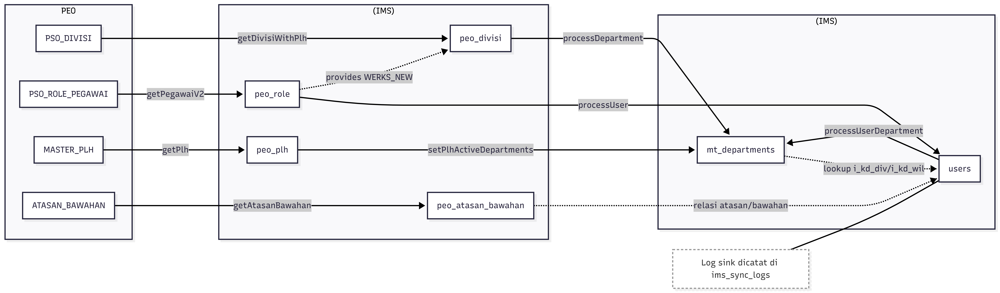

# Dokumentasi Teknis Sinkronisasi PEO → IMS

Ringkasan alur:
- PEO (Oracle) → sink `PSO_DIVISI`, `PSO_ROLE_PEGAWAI`, `MASTER_PLH` ke tabel staging `peo_divisi`, `peo_role`, `peo_plh`.
- Staging → MV: `peo_divisi` → `mt_departments`; `peo_role` → `users`; relasi user–department dihitung dari `users.i_kd_div / i_kd_wil` ke `mt_departments.code / i_kd_wil`.

## Wireframe alur sinkronisasi (arah PEO → IMS)



## mt_departments (target)

| Kolom target | Nilai/Transform | Sumber PEO (tabel.kolom) | Logika sumber | Catatan |
| --- | --- | --- | --- | --- |
| `id` | auto increment | – | – | Dibuat DB. |
| `code` | `KD_DIV_ARSIP` disanitasi (hapus `_`) | `PSO_DIVISI.KD_DIV_ARSIP` | Diambil dari `PSO_DIVISI` yang lolos filter `getDivisiWithPlh`: `KD_DIV_ARSIP` non-null, `IS_DELETED` null, `GRUP` & `INSTANSI` ada di whitelist. Join ke `MASTER_PLH`/`PSO_ROLE_PEGAWAI`; kondisi OR membuat divisi tetap masuk walau tidak ada pegawainya di `PSO_ROLE_PEGAWAI`, dan `MASTER_PLH` memastikan divisi tetap terikut. Sanitasi di sink-divisi. | |
| `name`, `description` | `NAMA_DIR` | `PSO_DIVISI.NAMA_DIR` | Selalu dari `PSO_DIVISI`. | Diset sama. |
| `is_active` | `true` saat insert/update | – | Turun jadi `false` bila `mt_departments.updated_at` < MAX(`peo_divisi.updated_at`); balik `true` jika ada PLH aktif. | |
| `parent` | FK ke `mt_departments.id` berdasar parent code pertama pada `i_parent` | – | Dihitung ulang setelah insert; butuh parent code ditemukan di `mt_departments` aktif dengan `i_kd_wil` sama. | |
| `department_level` | tidak diisi | – | – | Bergantung default DB/null. |
| `i_com_code` | `WERKS_NEW` | `PSO_ROLE_PEGAWAI.WERKS_NEW` | Diambil lewat `getDivisiWithPlh`, yang melakukan LEFT JOIN ke tabel `PSO_ROLE_PEGAWAI` dan memilih kolom `WERKS_NEW`. Terisi bila ada pegawai pada divisi itu yang lolos filter `PSO_ROLE_PEGAWAI`; jika tidak ada (atau hanya ada data `MASTER_PLH` tanpa pegawai terfilter) bisa tetap null. | |
| `i_objid`, `i_parid`, `i_bobot_organisasi` | tidak diisi | – | – | Selalu null/default. |
| `i_level_organisasi` | `JENIS` → number | `PSO_DIVISI.JENIS` | Selalu dari `PSO_DIVISI`. | |
| `i_endda` | `9999-12-31 00:00:00` | – | Konstanta. | |
| `instansi` | `GRUP` | `PSO_DIVISI.GRUP` | Selalu dari `PSO_DIVISI`. | |
| `i_nama_cabang` | `NAMA_CABANG` | `PSO_DIVISI.NAMA_CABANG` | Selalu dari `PSO_DIVISI`. | |
| `i_kd_wil` | `KD_WIL_ARSIP` | `PSO_DIVISI.KD_WIL_ARSIP` | Selalu dari `PSO_DIVISI`. | |
| `i_parent` | path string parent | `PSO_DIVISI.PARENT` | Selalu dari `PSO_DIVISI`. | Format `;CODE1;CODE2;...`. |
| `i_updated_at` | timestamp proses | – | Konstanta waktu sink. | |

Logika aktivasi/penonaktifan:
- Penonaktifan massal: `is_active = false` jika `mt_departments.updated_at` < MAX(`peo_divisi.updated_at`).
- Re-aktivasi: `is_active = true` bila ada PLH (`peo_plh` dengan `kd_div` & `kd_wil` yang sama).

## users (target)

| Kolom target | Nilai/Transform | Sumber PEO (tabel.kolom) | Logika sumber | Catatan |
| --- | --- | --- | --- | --- |
| `id` | UUID | – | – | Dibuat sebelum insert. |
| `password` | default password (di-hash) | – | Konstanta, bukan dari PEO. | Tidak merinci nilai. |
| `email` | uppercase email; fallback `${NIPP_BARU}@MAIL.COM` | `PSO_ROLE_PEGAWAI.EMAIL` | Selalu dari `PSO_ROLE_PEGAWAI`, fallback jika kosong/tidak mengandung `@`. | |
| `first_name` | token pertama `NAMA` | `PSO_ROLE_PEGAWAI.NAMA` | Selalu dari `PSO_ROLE_PEGAWAI`. | |
| `last_name` | token terakhir `NAMA` | `PSO_ROLE_PEGAWAI.NAMA` | Selalu dari `PSO_ROLE_PEGAWAI`. | |
| `full_name` | `${NAMA} # ${NAMA_JABATAN}` | `PSO_ROLE_PEGAWAI.NAMA`, `NAMA_JABATAN` | Selalu dari `PSO_ROLE_PEGAWAI`. | |
| `nip` | `NIPP` | `PSO_ROLE_PEGAWAI.NIPP` | Selalu dari `PSO_ROLE_PEGAWAI`. | |
| `nip_new` | `NIPP_BARU` | `PSO_ROLE_PEGAWAI.NIPP_BARU` | Selalu dari `PSO_ROLE_PEGAWAI`. | |
| `i_com_code`, `i_werk` | `WERKS_NEW` | `PSO_ROLE_PEGAWAI.WERKS_NEW` | Selalu dari `PSO_ROLE_PEGAWAI` record terfilter. | |
| `i_department_code` | tidak diisi | – | – | |
| `i_job_code` | tidak diisi | – | – | |
| `i_job_name` | `NAMA_JABATAN` | `PSO_ROLE_PEGAWAI.NAMA_JABATAN` | Selalu dari `PSO_ROLE_PEGAWAI`. | |
| `i_id` | tidak diisi | – | – | |
| `i_endda` | `'9999-12-31'` | – | Konstanta. | |
| `pegawai` | `GRUP` | `PSO_ROLE_PEGAWAI.GRUP` | Selalu dari `PSO_ROLE_PEGAWAI`. | |
| `instansi` | sama dengan `pegawai` (`GRUP`) | `PSO_ROLE_PEGAWAI.GRUP` | Diset dari field `pegawai` di entitas. | |
| `i_nama_cabang` | `NAMA_CABANG` | `PSO_ROLE_PEGAWAI.NAMA_CABANG` | Selalu dari `PSO_ROLE_PEGAWAI`. | |
| `i_kd_sub` | `KD_SUB` | `PSO_ROLE_PEGAWAI.KD_SUB` | Selalu dari `PSO_ROLE_PEGAWAI`. | |
| `i_kd_wil` | `KD_WIL_ARSIP` | `PSO_ROLE_PEGAWAI.KD_WIL_ARSIP` | Selalu dari `PSO_ROLE_PEGAWAI`. | |
| `i_kd_div` | `KD_DIV_ARSIP` disanitasi (hapus `_`) | `PSO_ROLE_PEGAWAI.KD_DIV_ARSIP` | Selalu dari `PSO_ROLE_PEGAWAI`; sanitasi di sink-pegawai. | |
| `department` | FK ke `mt_departments.id` berdasar `i_kd_div` + `i_kd_wil` | – | Dihitung setelah user tersinkron; butuh department aktif dengan code & wilayah sama. | |
| `job` | tidak diisi | – | – | |
| `is_active` | `true` saat sink; bisa menjadi `false` jika `updated_at` < MAX(`peo_role.updated_at`) | – | – | |

Logika tambahan:
- Data diambil bertahap (pagination 100 row) dan hanya record dengan `updated_at` > last log (`ims_sync_logs` code sink users).
- Relasi department dihitung setelah user disinkron, menggunakan `mt_departments` aktif.

## Sumber staging (sink) ringkas
- `peo_divisi` diisi dari `PSO_DIVISI` via `getDivisiWithPlh` (prioritas `MASTER_PLH` + `PSO_ROLE_PEGAWAI`; sekarang select `WERKS_NEW` dari `PSO_ROLE_PEGAWAI`, sehingga `i_com_code` bisa terisi bila ada pegawai di divisi itu).
- `peo_role` diisi dari `PSO_ROLE_PEGAWAI` (filter instansi ≠ 9999, grup & nipp_baru tidak null, WERKS_NEW & email tidak null, tidak mengandung nama dummy/user/test/sit).
- `peo_plh` diisi dari `MASTER_PLH` (digunakan untuk re-aktivasi department via divisi yang punya data di `MASTER_PLH`).
- `peo_atasan_bawahan` diisi dari `ATASAN_BAWAHAN` (hanya relasi NIPP↔NIPP_ATS yang lolos filter kualifikasi pegawai di `PSO_ROLE_PEGAWAI`; dipakai sebagai staging relasi atasan-bawahan).

## Query sumber data (saat sink)

### Insert/Upsert `peo_divisi` (sink-divisi, varian aktif `getDivisiWithPlh`)
```sql
SELECT d.*, r.WERKS_NEW
FROM PSO_DIVISI d
LEFT JOIN (
  SELECT DISTINCT KD_DIV, KD_WIL
  FROM MASTER_PLH
) m
  ON d.KD_DIV_ARSIP = m.KD_DIV AND d.KD_WIL_ARSIP = m.KD_WIL
LEFT JOIN (
  SELECT KD_DIV_ARSIP, KD_WIL_ARSIP, NIPP_BARU, WERKS_NEW
  FROM PSO_ROLE_PEGAWAI
  WHERE INSTANSI <> '9999'
    AND NIPP_BARU IS NOT NULL
    AND WERKS_NEW IS NOT NULL
    AND EMAIL IS NOT NULL
    AND (:nipp_new IS NULL OR NIPP_BARU = :nipp_new)
) r
  ON d.KD_DIV_ARSIP = r.KD_DIV_ARSIP AND d.KD_WIL_ARSIP = r.KD_WIL_ARSIP
WHERE d.KD_DIV_ARSIP IS NOT NULL
  AND d.IS_DELETED IS NULL
  AND d.GRUP IN (:grups)
  AND d.INSTANSI IN (:grups)
  AND (
    m.KD_DIV IS NOT NULL          -- ada data MASTER_PLH
    OR r.KD_DIV_ARSIP IS NOT NULL -- ada pegawai di PSO_ROLE_PEGAWAI
    OR r.KD_DIV_ARSIP IS NULL     -- fallback: tetap diikutkan meski tanpa pegawai
  )
ORDER BY d.KD_DIV_ARSIP, d.KD_WIL_ARSIP, d.GRUP
OFFSET :offset ROWS FETCH NEXT :limit ROWS ONLY;
```
Penjelasan singkat:
- Ambil semua DIVISI yang tidak terhapus dan grup/instansi sesuai whitelist.
- LEFT JOIN `MASTER_PLH` supaya divisi dengan penugasan PLH tetap terbawa walau belum ada pegawai aktif.
- LEFT JOIN `PSO_ROLE_PEGAWAI` untuk mengecek ada pegawai dan menarik `WERKS_NEW`.
- Klausa OR pada WHERE memastikan divisi tetap diikutkan (fallback) sekalipun tidak ada record di `PSO_ROLE_PEGAWAI`; PLH juga cukup untuk meloloskan.
- Pagination via `OFFSET :offset LIMIT :limit`.

### Insert/Upsert `peo_role` (sink-pegawai, varian aktif `getPegawaiV2`)
```sql
SELECT *
FROM PSO_ROLE_PEGAWAI p
WHERE EXISTS (
  SELECT 1 FROM PSO_ROLE_PEGAWAI p2
  WHERE p2.NIPP_BARU = p.NIPP_BARU
    AND p2.INSTANSI <> '9999'
    AND p2.GRUP IS NOT NULL
    AND p2.NIPP_BARU IS NOT NULL
    AND p2.GRUP IN (:grups)
    AND p2.COMPANY_CODE <> '9999'
    AND p2.WERKS_NEW IS NOT NULL
    AND p2.EMAIL IS NOT NULL
    AND LOWER(p2.NAMA) NOT LIKE '%dummy%'
    AND LOWER(p2.NAMA) NOT LIKE '%user%'
    AND LOWER(p2.NAMA) NOT LIKE '%test%'
    AND LOWER(p2.NAMA) NOT LIKE '%sit -%'
    AND p2.KD_DIV_ARSIP IS NOT NULL
    AND (:nipp_new IS NULL OR p2.NIPP_BARU = :nipp_new)
)
OR EXISTS (
  SELECT 1 FROM MASTER_PLH m
  WHERE m.NIPP_PLH_BARU = p.NIPP_BARU
    AND m.AKHIR > SYSDATE
    AND (:nipp_new IS NULL OR m.NIPP_PLH_BARU = :nipp_new)
)
ORDER BY p.NIPP
OFFSET :offset ROWS FETCH NEXT :limit ROWS ONLY;
```
Penjelasan singkat:
- Pilih pegawai yang memenuhi filter kebersihan data (instansi ≠ 9999, grup & NIPP_BARU tidak null, WERKS_NEW/email tidak null, nama tidak dummy/test).
- EXISTS pertama memastikan baris utama hanya ikut jika ada rekannya (NIPP_BARU sama) yang valid; ini menyaring konsistensi per NIPP_BARU.
- EXISTS kedua memasukkan pegawai yang tercatat sebagai PLH aktif di `MASTER_PLH` (AKHIR > SYSDATE), meski mungkin tidak lolos filter pertama.
- Pagination via `OFFSET :offset LIMIT :limit`.

### Insert/Upsert `peo_plh` (sink-plh)
```sql
SELECT *
FROM MASTER_PLH
WHERE (:nipp_new IS NULL OR NIPP_PLH = :nipp_new)
ORDER BY ID
OFFSET :offset ROWS FETCH NEXT :limit ROWS ONLY;
```
Penjelasan singkat:
- Ambil data PLH mentah dari `MASTER_PLH`, bisa difilter per `:nipp_new`.
- Hanya pagination; tidak ada filter kualitas data lain di sini.

### Insert/Upsert `peo_atasan_bawahan` (sink-atasan-bawahan)
```sql
SELECT ab.*, ab.INSTANSI AS PEGAWAI
FROM ATASAN_BAWAHAN ab
WHERE ab.NIPP_BARU IS NOT NULL
  AND ab.NIPP_ATS_BARU IS NOT NULL
  AND ab.EMAIL IS NOT NULL
  AND ab.EMAIL_ATS IS NOT NULL
  AND ab.INSTANSI IN (:grups)
  AND ab.NIPP IN (
    SELECT DISTINCT NIPP
    FROM PSO_ROLE_PEGAWAI pr
    WHERE pr.INSTANSI <> '9999'
      AND pr.COMPANY_CODE <> '9999'
      AND pr.GRUP IS NOT NULL
      AND pr.NIPP_BARU IS NOT NULL
      AND pr.WERKS_NEW IS NOT NULL
      AND pr.EMAIL IS NOT NULL
      AND lower(pr.NAMA) NOT LIKE '%dummy%'
      AND lower(pr.NAMA) NOT LIKE '%user%'
      AND lower(pr.NAMA) NOT LIKE '%test%'
      AND lower(pr.NAMA) NOT LIKE '%sit -%'
      AND pr.KD_DIV_ARSIP IS NOT NULL
      AND pr.GRUP IN (:grups)
      AND (:nipp_new IS NULL OR pr.NIPP_BARU = :nipp_new)
  )
ORDER BY ab.NIPP_BARU, ab.NIPP_ATS_BARU
OFFSET :offset ROWS FETCH NEXT :limit ROWS ONLY;
```
Penjelasan singkat:
- Hanya relasi bawahan-atasan yang memiliki NIPP/NIPP_ATS serta email di kedua pihak.
- Dibatasi pada grup perusahaan yang terdaftar (`:grups`).
- Subquery memastikan kedua pihak berada di `PSO_ROLE_PEGAWAI` yang lolos filter kualitas (instansi/grup/werks/email/tidak dummy, dll); opsional filter `:nipp_new`.
- Pagination via `OFFSET :offset LIMIT :limit`.

## Sumber final (dengan fungsi aktif)
- Department (`mt_departments`): dari `PSO_DIVISI` via `getDivisiWithPlh` → `peo_divisi`; `WERKS_NEW` ikut lewat join `PSO_ROLE_PEGAWAI`, sehingga `i_com_code` terisi jika ada pegawai di divisi tersebut (tetap bisa null jika divisi hanya punya data `MASTER_PLH` tanpa pegawai yang memenuhi filter `PSO_ROLE_PEGAWAI`).
- User (`users`): dari `PSO_ROLE_PEGAWAI` via `getPegawaiV2` → `peo_role`; semua kolom user mapping terisi, termasuk `i_com_code/i_werk` dari `WERKS_NEW`.

## Titik keputusan penting
- `KD_DIV_ARSIP` selalu disanitasi (hapus `_`) sebelum disimpan di staging dan dipakai di MV—penting saat mencocokkan ke `mt_departments`.
- `is_active` pada department/user dipakai sebagai penanda “tidak lagi ada di PEO”; di-drive oleh perbandingan `updated_at` dengan MAX timestamp di staging masing-masing.
- `parent` department numeric hanya akan terisi jika parent code pertama pada `i_parent` ditemukan sebagai department aktif di wilayah (`i_kd_wil`) yang sama.
- Kolom yang dibiarkan kosong/tidak diisi di tabel IMS adalah sisa struktur lama dari MDM dan memang tidak dipakai dalam alur sinkronisasi ini.
